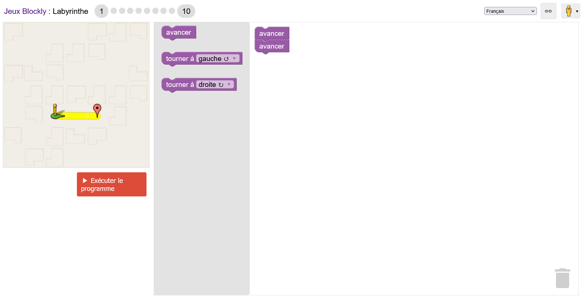
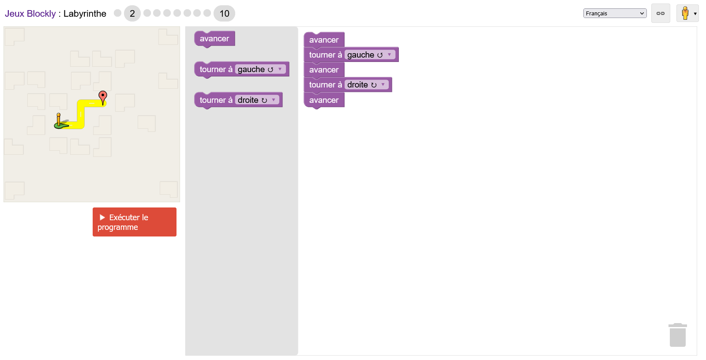
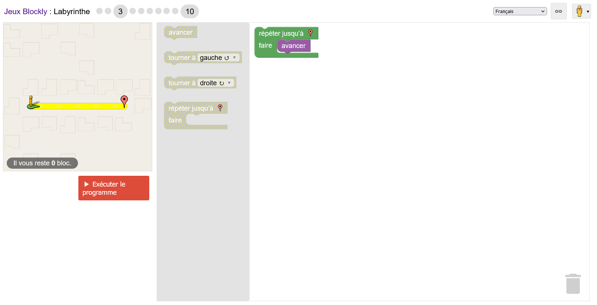
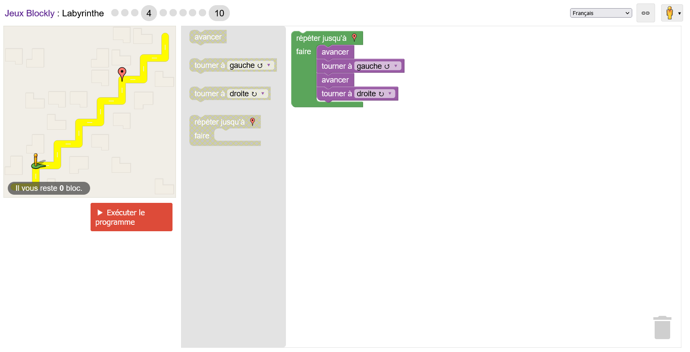
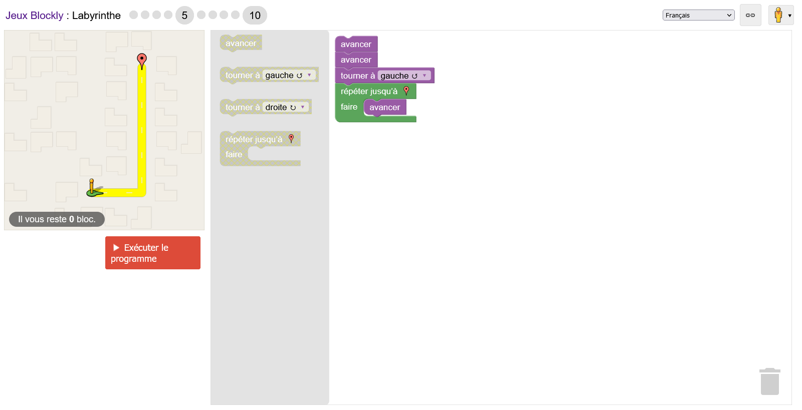
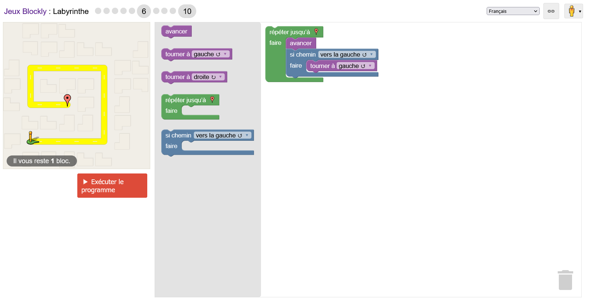
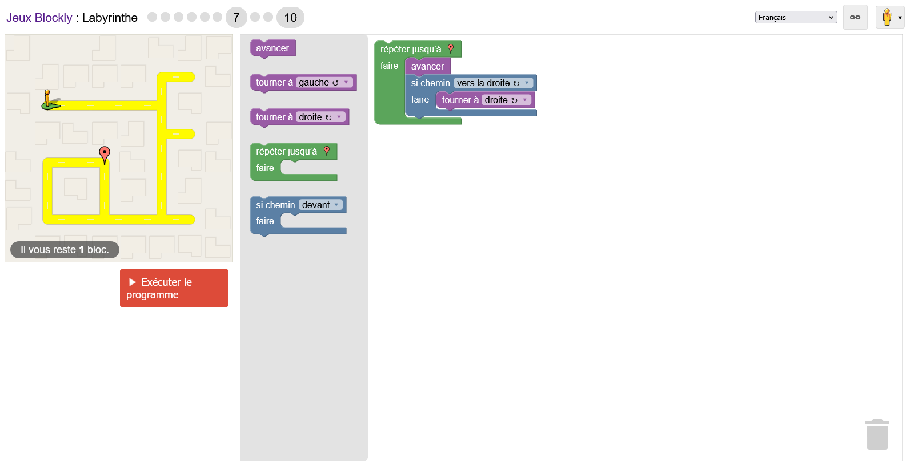
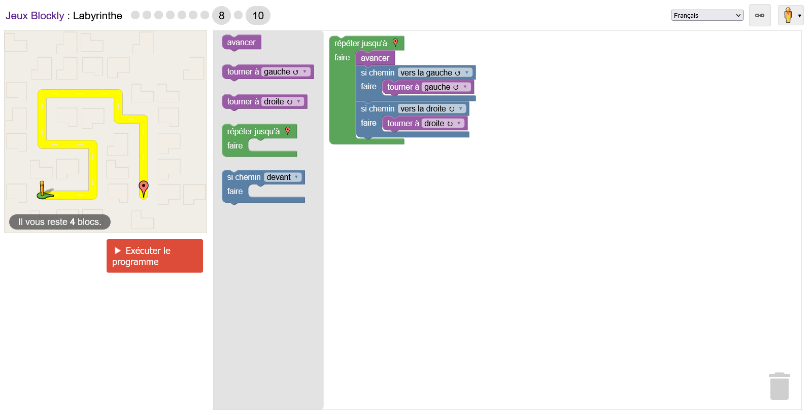
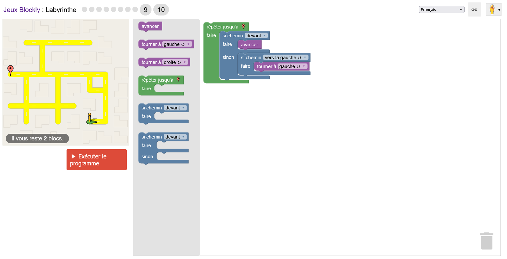
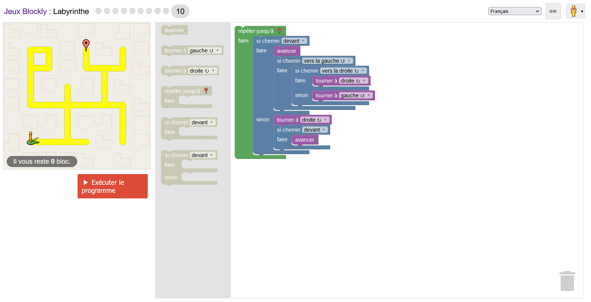

## Correction jeux Blocky : Labyrinthe

[Lien du jeu](https://blockly.games/maze?lang=fr)

### Niveau 1

### Niveau2

### Niveau 3

### Niveau 4

### Niveau 5

### Niveau 6

### Niveau 7

### Niveau 8

### Niveau 9

### Niveau 10

Solution avec le chemin le plus court, mais ce n'est pas la plus optimisée. La solution optimisée avec moins de blocs consiste à passer par le chemin de gauche.

